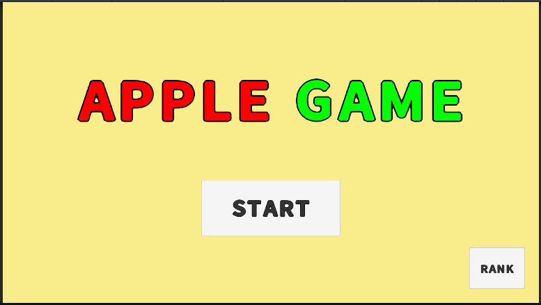
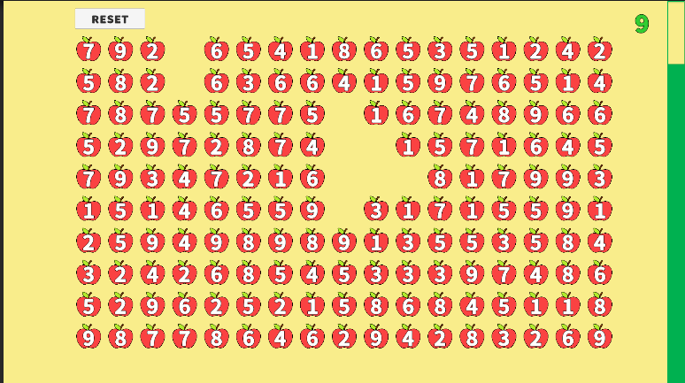

# Apple



Unity 6 기반의 2D 숫자 선택 게임 프로젝트입니다.  
플레이어는 화면에 배치된 사과들을 드래그로 선택하고, 선택한 숫자의 합이 `10`이 되면 해당 사과들이 제거되며 점수를 얻습니다.

## 프로젝트 개요

- 엔진: Unity `6000.3.12f1`
- 렌더링: Universal Render Pipeline `17.3.0`
- UI: uGUI, TextMesh Pro
- 입력: Input System 패키지 설치, 프로젝트 설정은 `Both` 활성화
- 기본 해상도: `1280 x 720`
- 시작 씬: `Assets/Scenes/SampleScene.unity`

## 게임 규칙

1. 게임 시작 시 사과가 `17 x 10` 그리드로 생성됩니다.
2. 각 사과에는 `1~9` 사이의 숫자가 표시됩니다.
3. 마지막 사과의 숫자를 조정해서 전체 숫자 합이 항상 `10`의 배수가 되도록 맞춥니다.
4. 플레이어는 마우스로 영역을 드래그해 여러 사과를 선택할 수 있습니다.
5. 드래그 영역 안에 포함된 사과 숫자의 합이 정확히 `10`이면:
   - 선택한 사과가 제거됩니다.
   - 제거한 사과 개수만큼 점수를 얻습니다.
6. 합이 `10`이 아니면 선택만 해제되고 아무 변화도 없습니다.
7. 제한 시간(`maxTime`)이 끝나면 게임이 종료되고 현재 점수를 표시합니다.

## 게임 화면



## 점수 및 랭킹

게임 오버 시 현재 점수를 HTTP API로 전송합니다.

- 점수 저장: `POST /api/scores`
- 랭킹 조회: `GET /api/scores/rankings?limit=10`

기본 서버 설정은 다음과 같습니다.

- Host: `192.168.0.68`
- Port: `5050`

이 값은 다음 스크립트의 인스펙터 직렬화 필드로 정의되어 있으므로 Unity 에디터에서 변경할 수 있습니다.

- `Assets/Scripts/GameController.cs`
- `Assets/Scripts/RankPanel.cs`

## 주요 스크립트

### `Assets/Scripts/Apple.cs`

- 사과 UI 오브젝트의 숫자와 선택 상태를 관리합니다.
- 선택 시 회색, 해제 시 흰색으로 표시를 변경합니다.

### `Assets/Scripts/AppleSpawner.cs`

- 사과 프리팹을 격자 형태로 생성합니다.
- 각 사과의 위치와 숫자를 초기화합니다.
- 제거된 사과를 리스트에서 정리하고 오브젝트를 파괴합니다.

### `Assets/Scripts/MouseDragController.cs`

- 마우스 드래그 영역을 계산하고 화면에 표시합니다.
- 드래그 영역에 포함된 사과를 선택합니다.
- 선택된 숫자 합이 `10`이면 사과 제거 및 점수 증가를 처리합니다.

### `Assets/Scripts/GameController.cs`

- 메인 메뉴, 인게임, 게임 오버 UI 전환을 담당합니다.
- 타이머, 점수 증가, 게임 종료를 관리합니다.
- 게임 종료 시 점수를 서버로 전송합니다.

### `Assets/Scripts/RankPanel.cs`

- 랭킹 패널이 열릴 때 서버에서 랭킹 정보를 가져옵니다.
- 받아온 랭킹 데이터를 슬롯 UI로 생성합니다.

### `Assets/Scripts/RankSlot.cs`

- 랭킹 1개 항목의 텍스트 출력을 담당합니다.

## 폴더 구조

```text
Assets/
  Prefabs/        사과, 랭킹 슬롯 프리팹
  Resource/       스프라이트, 폰트, TMP 리소스
  Scenes/         메인 씬(SampleScene)
  Scripts/        게임 로직 스크립트
  Settings/       URP 및 2D 렌더러 설정
Packages/
  manifest.json   사용 중인 Unity 패키지 목록
Images/
  title.png       리드미 타이틀 이미지
  game.png        실제 게임 화면 이미지
ProjectSettings/
  ProjectVersion.txt
  ProjectSettings.asset
```

## 실행 방법

1. Unity Hub에서 이 폴더를 프로젝트로 엽니다.
2. Unity Editor `6000.3.12f1` 버전을 사용합니다.
3. `Assets/Scenes/SampleScene.unity`를 엽니다.
4. 필요하면 `GameController`, `RankPanel`의 서버 주소를 현재 환경에 맞게 수정합니다.
5. Play 버튼으로 실행합니다.

## 확인된 특징 및 주의사항

- 현재 저장소에는 프로젝트 전용 테스트 코드가 보이지 않습니다.
- 점수 서버는 이 저장소에 포함되어 있지 않으므로, 랭킹/점수 저장 기능은 별도 백엔드가 실행 중이어야 정상 동작합니다.
- `RankPanel.cs`, `RankSlot.cs`의 일부 한국어 문자열은 현재 파일 인코딩 문제로 깨져 보입니다. 실제 UI 문구를 정리하려면 해당 문자열을 UTF-8 기준으로 다시 입력하는 작업이 필요합니다.
- 마우스 입력 로직은 `Input.GetMouseButton*` 기반으로 구현되어 있어 현재 플레이 방식은 PC 마우스 조작에 맞춰져 있습니다.

## 사용 패키지

핵심적으로 다음 패키지를 사용합니다.

- `com.unity.render-pipelines.universal`
- `com.unity.inputsystem`
- `com.unity.ugui`
- `com.unity.test-framework`
- 2D 관련 패키지(`animation`, `spriteshape`, `tilemap` 등)

## 한 줄 요약

이 프로젝트는 "여러 숫자 사과를 드래그로 묶어 합을 10으로 만들면 제거하고 점수를 얻는" Unity 2D 아케이드 퍼즐 게임입니다.
